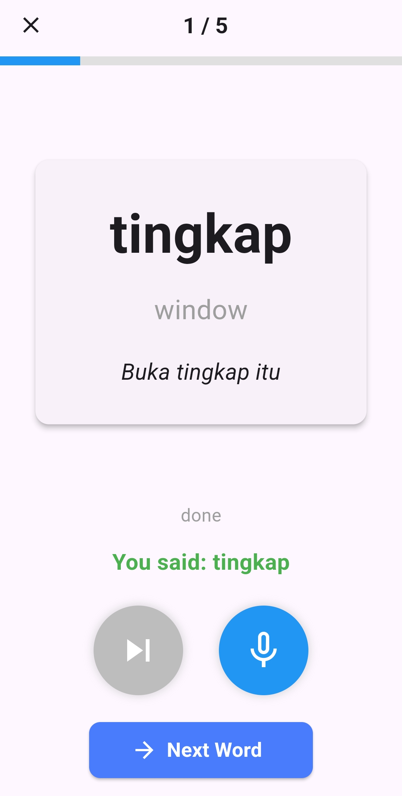

# Main Setup

1. Coding Editor : Visual Studio Code
2. Programming Framework : Flutter (Dart Programming Language)
3. Google Play Services
4. Google Gemini API
5. Pub Dev Packages

# Dependency Management

Since this is a flutter project, **all dependencies** used can be viewed in `pubspec.yaml`

Additionally Flutter version `3.24.3` and Android SDK version `34.0.0`

# Main Devices Tested

1. Android Emulator : Pixel 7 API 31
2. Physical Phone : Oppo A95

# Cerah ☀️

Hi this is Kok Shen here 👋👋 below will be my basic participant information

Name : Chang Kok Shen

Email : kokshen3414@gmail.com

Phone Number : 014-9713623

Team Registration Type :  Team Solo

Team Name : Try Lah

# App Logo

  

# Core Functionalities

1. Resources module
   - Math
     - Free & Unlimited worksheet generation
     - Math recognition
   - English
     - Free eBooks (short stories)
   - Malay
     - Learn basic vocabulary through an interesting quiz (5 rounds each time)
     - Powered by voice recognition
2. Chat module
   - Online chatbot
     - Communicate with a free AI education bot powered through Google Gemini
3. FAQ module
   - Question and answer
     - Understand and get overall view of Cerah's main functionalities

# Screenshots of Cerah App

**Home Screen**

  

---

**Math recognition**

  

---

**Short stories**

  

---

**Malay voice recognition**

  

---

**Cerah Education Bot**

  

---

**Frequently Asked Questions**

  

# Extra Info (For Bonus marks)

Additionally, I have uploaded my app (Cerah) on Huawei AppGallery for obtaining the bonus marks

- Upload date : 28-10-2024
- To note, a review process might fluctuate from **2-7 days** 

Below screenshot shows the proof of Upload in **Huawei AppGallery**

  

Alternatively, judges may search up the application on **Huawei AppGallery** as shown in the screenshot below

  

